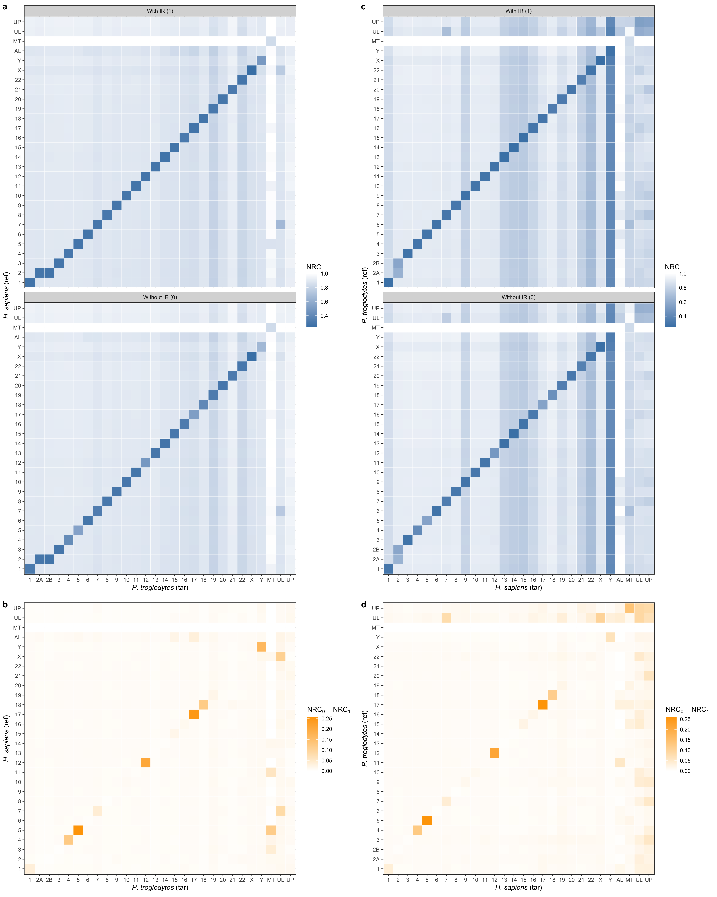

# Plots

## 2.7

[Code](2.7/ir_nrc_hs_pt.R)

## 2.8

[Code](2.8/ir_nrc_hs_gg.R)

## 2.9

[Code](2.9/ir_nrc_gga_mga.R)

## 3.13

[Code](3.13/ac_nc.R)

## 4.7

[Code](4.7/cryfa_enc_aes.R)

## 4.8

[Code](4.8/cryfa_comp_enc.R)

## 4.9

[Code](4.9/cryfa_thread.R)

## 4.10

[Code](4.10/cryfa_redun.R)

## 5.3

[Code](5.3/fruit_mut.R)

## 5.4

[Code](5.4/fruit_hist_uniq_prob.R)

## Extra

[Code](extra/survey_comp_ratio.R)

